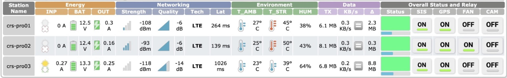
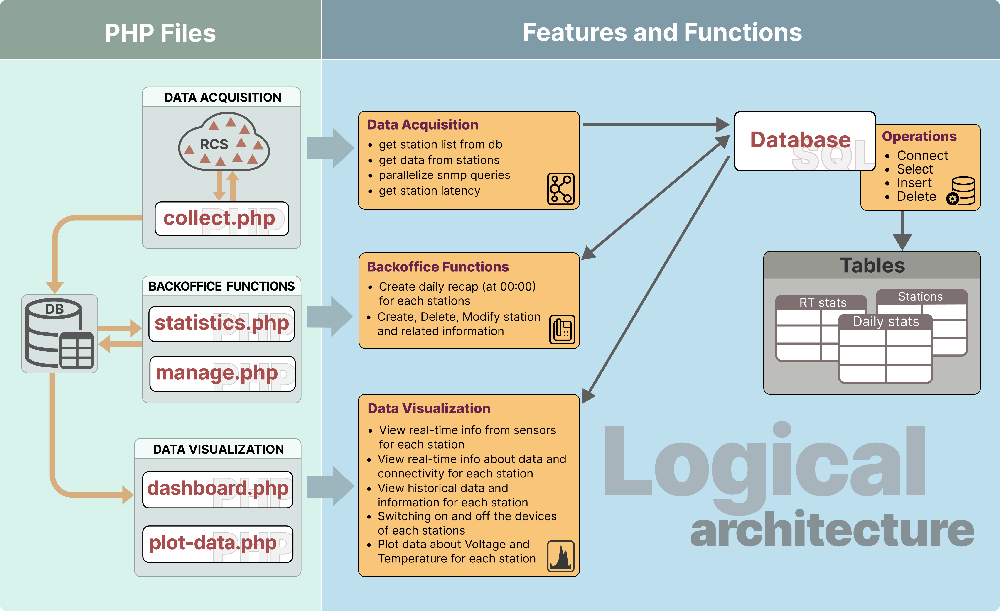
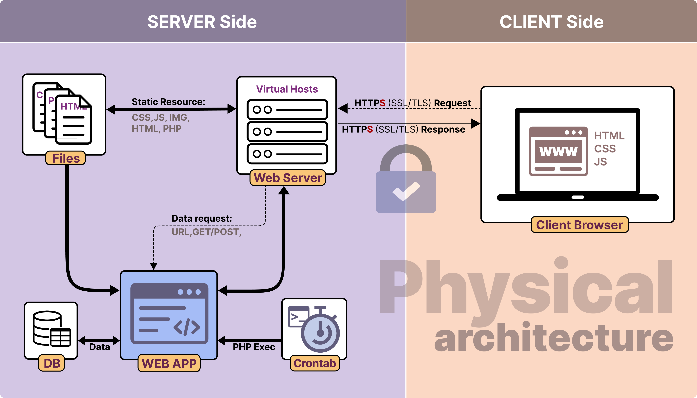

# Station-monitor

A web-based monitoring system for remote seismic stations

# Overview
Station Monitor is a web application developed to monitor the operational status and health of remote seismic stations deployed in industrial and operational seismic networks.
The system provides real-time and historical diagnostics, supports automated data acquisition, and offers a centralized dashboard for supervising station connectivity, latency, and key operational parameters.
The software was developed for real-world monitoring scenarios, where reliability, automation, and rapid diagnostics are critical.

 
# Main Features
## Data acquisition
-	Automatic retrieval of station list from database
-	Data acquisition from remote stations
-	Parallelized SNMP queries
-	Measurement of station latency and connectivity 

## Backoffice & automation
-	Scheduled tasks via crontab
-	Daily statistics generation (automatic recap at 00:00)
-	Create, update and manage stations and related metadata

## Data visualization
-	Real-time monitoring of station status and sensors
-	Visualization of connectivity and data availability
-	Historical data inspection
-	Interactive dashboard for network supervision
-	Plotting of voltage and temperature time series
-	Remote switching on/off of station devices (where supported)
 
# Logical Architecture
The logical architecture is organized around three main functional layers: data acquisition, backoffice processing, and data visualization, all interacting through a centralized database.

 
# Physical Architecture
From a physical perspective, the system follows a classic client–server architecture, with secure HTTPS communication, scheduled background tasks, and server-side data processing.

 
# Technical Stack
-	Backend: PHP
-	Database: SQL-based relational database
-	Frontend: HTML, CSS, JavaScript
-	Automation: cron jobs
-	Protocols: HTTPS (SSL/TLS), SNMP
 
# Repository content
This repository contains a sanitized version of the original software:
-	no real endpoints
-	no credentials
-	no proprietary or sensitive data
-	no customer-identifying information

The code is provided to document the software architecture, design choices, and implementation approach.
 
# Context of use
The system was designed and used in the context of industrial seismic monitoring networks, supporting:
-	network diagnostics
-	operational continuity
-	quality control of data acquisition infrastructures
 
# License
This project is released under an open-source license to support transparency, reproducibility, and reuse in scientific and technological contexts.

